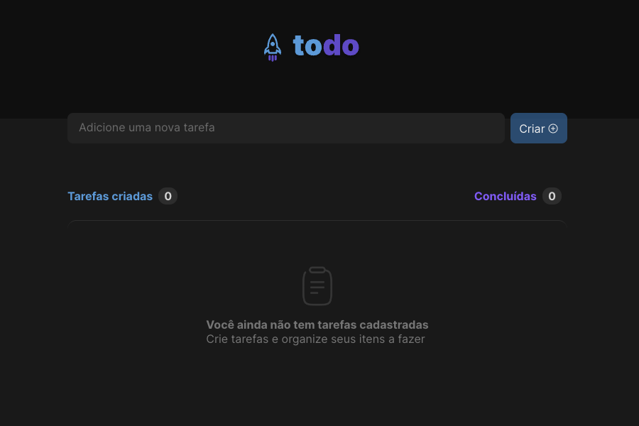
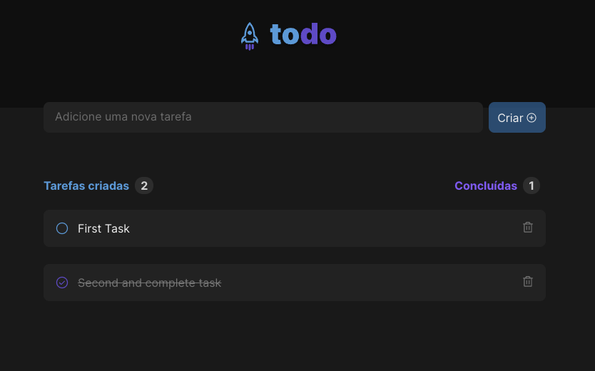

# RocketSeat first chellenge - To Do

<h2>About</h2>
  
The project is a to-do list, where you input your backlog and mark as completed. Also, is possible to delete the task. Every action will increase or decrease the amount of tasks created and done.
  Also, is possible to test the accessibility between the devices that will access it.

 <h2>Execute</h2>
     <pre>
     
        # clone the repository
        git clone https://github.com/LDLima/React-1.git

        # install dependencies
        npm install

        # execute
        npm run dev

        # access in your browser
        localhost:3001

   </pre>
   
   <h2>Layout</h2>
    
    

   <h2>Obs</h2>
   The project layout is in portuguese, since it's done folowing the instructions and learn with <a href="https://www.rocketseat.com.br/">Rocketseat</a>.
   Also, the code structure is entirely in english as this readme, for practicing.
   
   <h2>Author</h2>
   
https://www.linkedin.com/in/luandomingues/

